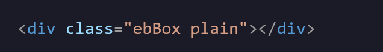

<div id="top"></div>

<div align="center">


<h1>✨ Earthbound Text Box ✨<br/> <span style="font-size: 15px">In HTML, and CSS!</span>

<div id="link">
<a  style="font-size:18px" href="https://theabsoluterealm.com/main/resourcesNtools/ebTBox">🌐 Project Page 🌐</a>
</div>
</div>

Do you like the game Earthbound? Ever wanted to style your website in fashion like the game's windows? Well, here it is! Featuring the nostalgic colors that you remember!

<hr>

<div style="width:250px; margin:0px auto; margin-bottom:20px;" align="center">

<p style="font-size: 20px; margin-bottom:0px; margin:5px">Plain</p>
<div style="
    border-width: 10px;
    border-style: solid;
    padding: 15px;
    border-image: url(assets/ebBoxPl.png) 27 stretch;"></div>

<p style="font-size: 20px; margin-bottom:0px; margin:5px">Mint</p>
<div style="
    border-width: 10px;
    border-style: solid;
    padding: 15px;
    border-image: url(assets/ebBoxM.png) 27 stretch;"></div>

<p style="font-size: 20px; margin-bottom:0px; margin:5px">Strawberry</p>
<div style="
    border-width: 10px;
    border-style: solid;
    padding: 15px;
    border-image: url(assets/ebBoxS.png) 27 stretch;"></div>

<p style="font-size: 20px; margin-bottom:0px; margin:5px">Banana</p>
<div style="
    border-width: 10px;
    border-style: solid;
    padding: 15px;
    border-image: url(assets/ebBoxB.png) 27 stretch;"></div>
    
<p style="font-size: 20px; margin-bottom:0px; margin:5px">Peanut</p>
<div style="
    border-width: 10px;
    border-style: solid;
    padding: 15px;
    border-image: url(assets/ebBoxPe.png) 27 stretch;"></div>
</div>

<hr>

### ⚡️ How to use

#### CSS

```css
.ebBox {
  border-image-outset: 0.55;
  border-image-width: 20px;
  border-style: solid;
  padding: 15px;
  margin: 6px;
}
```

- `border-image-width` changes the size of the border
  <br>
- `border-width` works as padding.

#### HTML

<div>

<br>

- `Multi-Class Usage` for ease of access. Just simply change the second class to the preferred flavor.
</div>

<hr>

### 🐞 FAQ

#### Why do I see the `background-color` peeking behind the border?

- If you plan on having a `background` or `background-color` inside the box, `border-image-outset` can be adjusted for it won't show the background peeking behind the box.

</div>
