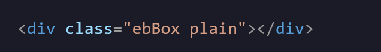

<div id="top"></div>

<div align="center">

<h1>✨ Earthbound Text Box ✨<br/> <span style="font-size: 15px">In HTML, and CSS!</span>

</div>

Are you a fan of EarthBound and its charming retro aesthetics? Now you can bring that same nostalgic style to your website! Capture the essence of the game's iconic windows with colors that transport you back to the whimsical world of Ness and his friends. Transform your digital space with the beloved visuals of this classic Nintendo game!

<hr>

This small project uses `border-image` to stretch the images to fit any size div you throw at it. Plus, it uses `Multi-Class` techniques to get everything looking just right.

<div style="width:250px; margin:0px auto; margin-bottom:20px;" align="center">

<p style="font-size: 20px; margin-bottom:0px; margin:5px">Plain</p>


<p style="font-size: 20px; margin-bottom:0px; margin:5px">Mint</p>


<p style="font-size: 20px; margin-bottom:0px; margin:5px">Strawberry</p>

<p style="font-size: 20px; margin-bottom:0px; margin:5px">Banana</p>


<p style="font-size: 20px; margin-bottom:0px; margin:5px">Peanut</p>


</div>

<hr>

## ⚡️ How to use

#### CSS

```css
.ebBox {
  border-image-outset: 0.55;
  border-image-width: 20px;
  border-style: solid;
  padding: 15px;
  margin: 6px;
}
```

- `border-image-width` changes the size of the border
  <br>
- `border-width` works as padding.

#### HTML

<div>

<br>

- `Multi-Class Usage` for ease of access. Just simply change the second class to the preferred flavor.
</div>

## ❓ FAQ

#### 1. Why do I see the `background-color` peeking behind the border?

- If you plan on having a `background` or `background-color` inside the box, `border-image-outset` can be adjusted for it won't show the background peeking behind the box.

#### 2. Why is `border-image-outset` and `border-image-width` not working?

- `border-image` must be defined first before the `border-image-outset` and `border-image-width` get defined. Basically, the flavor needs to be defined first. For example:

### ❌

```css
.ebBox {
  border-image-outset: 0.55;
  border-image-width: 20px;
  border-style: solid;
  padding: 15px;
  margin: 6px;
}

.plain {
  border-image: url("assets/ebBoxPl.png") 27 stretch;
  background-color: #101010;
}
```

### ✔️

```css
.plain {
  border-image: url("assets/ebBoxPl.png") 27 stretch;
  background-color: #101010;
}

.ebBox {
  border-image-outset: 0.55;
  border-image-width: 20px;
  border-style: solid;
  padding: 15px;
  margin: 6px;
}
```

</div>
